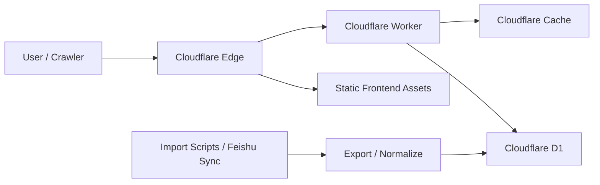

# 棋飞书库 Cloudflare 重构详细设计

> 历史文档：本文记录迁移设计。当前生产实现已经是 Cloudflare Worker + D1 + Workers Assets，旧 Next.js / React / Vercel 代码路径已在 2026-05-17 的生产路径清理中删除。文中对旧前端文件的引用只用于解释迁移背景。

## 当前实现状态

更新时间：2026-05-17

本文档最初描述目标设计。当前项目已经完成生产迁移和旧代码删除，实际线上架构如下：

- Cloudflare Worker：`worker/index.ts`、`worker/routes.ts`
- Worker HTML 模板：`worker/templates.ts`
- Worker D1 查询：`worker/db.ts`
- D1 migration：`db/migrations/0001_init.sql`
- Cloudflare 配置：`wrangler.jsonc`
- D1 database_id：`85829f2e-86fb-40d8-8b32-f9db64e56c00`
- 生产域名：`qifeibook.com`
- `www.qifeibook.com`：301 跳转到主域名

当前 Worker 已接管：

- `/`
- `/search`
- `/book/:id`
- `/category/:slug`
- `/sitemap.xml`
- `/robots.txt`
- `/api/*`

首页当前策略：

- Worker 直出首屏 HTML。
- 首屏展示 20 本书。
- 下拉到底部通过 `/api/books` 每次追加 20 本。
- 热门分类首屏展示 8 个分类，其余分类通过展开区域展示。

详情页当前策略：

- Worker 直出完整详情 HTML。
- 作者简介位于内容简介上方。
- 下载地址位于内容简介下方。
- 内容简介展开后保持同一段连续显示。
- 下载卡片只保留网盘名称、提取码、前往下载和复制提取码。

详细开发总结见 [当前开发总结](./current-development-summary.md)。

## 1. 文档目标

本文档描述棋飞书库从当前 Next.js 静态数据架构迁移到 Cloudflare Workers + D1 + 静态前端壳子的目标设计。

重点覆盖：

- 运行时边界
- 数据模型
- 路由职责
- API 设计
- SEO 输出设计
- 搜索与分页设计
- 缓存与性能策略
- 数据同步与部署方案

## 2. 现状摘要

当前系统由以下关键文件组成：

- [app/page.tsx](/Users/zcy/dev/github/qifeibook/app/page.tsx:1)：首页
- [app/book/[id]/page.tsx](/Users/zcy/dev/github/qifeibook/app/book/[id]/page.tsx:1)：书籍详情页
- [app/category/[id]/page.tsx](/Users/zcy/dev/github/qifeibook/app/category/[id]/page.tsx:1)：分类页
- [app/search/SearchContent.tsx](/Users/zcy/dev/github/qifeibook/app/search/SearchContent.tsx:1)：客户端搜索页
- [components/Header.tsx](/Users/zcy/dev/github/qifeibook/components/Header.tsx:1)：搜索框与分类云
- [components/BookList.tsx](/Users/zcy/dev/github/qifeibook/components/BookList.tsx:1)：列表与本地无限加载
- [data/mockData.ts](/Users/zcy/dev/github/qifeibook/data/mockData.ts:1)：整库静态数据

当前问题不是单点 bug，而是架构不再适配未来数据规模。

## 3. 目标架构



## 4. 运行时职责划分

### 4.1 静态前端壳子职责

- 承载全站基础布局、样式和客户端交互。
- 承载首页静态壳、搜索页壳、通用导航、空状态、分页容器。
- 通过 API 请求获取分页数据。
- 不直接导入全量书籍数据。

### 4.2 Worker 职责

- 提供 JSON API。
- 输出 SEO 关键 HTML 路由。
- 动态生成 sitemap。
- 控制缓存头与状态码。
- 聚合数据库查询与模板渲染。

### 4.3 D1 职责

- 持久化书籍元数据。
- 持久化分类信息和下载链接。
- 提供 FTS5 全文搜索能力。
- 提供按 `id/category/slug` 的高效查询能力。

### 4.4 导入脚本职责

- 从现有 `mockData.ts`、飞书或后续脚本产物中生成标准数据。
- 做字段清洗、去重、分类归一化。
- 生成 SQL seed 或直接写入 D1。

## 5. 路由设计

## 5.1 静态资源路由

- `/`
- `/search`
- `/assets/*`
- `/favicon.*`
- `/manifest.json`

说明：

- 页面壳子可静态部署。
- 首屏列表数据由 API 拉取，或在构建期注入少量热门数据。

## 5.2 Worker HTML 路由

- `/book/:id`
- `/category/:slug`
- `/sitemap.xml`
- `/sitemaps/:page.xml`
- `/robots.txt`

说明：

- 这些路由必须对搜索引擎友好。
- 返回完整 HTML、meta、JSON-LD。
- 即使关闭 JS 也必须可访问核心内容。

## 5.3 Worker API 路由

- `GET /api/home`
- `GET /api/books`
- `GET /api/books/:id`
- `GET /api/categories`
- `GET /api/category/:slug`
- `GET /api/search`

## 6. 数据模型设计

## 6.1 逻辑模型

### books

- `id` INTEGER PRIMARY KEY
- `slug` TEXT
- `title` TEXT NOT NULL
- `author` TEXT NOT NULL
- `author_detail` TEXT
- `description` TEXT
- `cover` TEXT
- `year` TEXT
- `publish_year` TEXT
- `format` TEXT
- `size` TEXT
- `category_id` INTEGER NOT NULL
- `keywords_json` TEXT
- `created_at` TEXT
- `updated_at` TEXT

### categories

- `id` INTEGER PRIMARY KEY
- `slug` TEXT UNIQUE NOT NULL
- `name` TEXT UNIQUE NOT NULL
- `book_count` INTEGER NOT NULL DEFAULT 0

### download_links

- `id` INTEGER PRIMARY KEY
- `book_id` INTEGER NOT NULL
- `provider` TEXT NOT NULL
- `name` TEXT NOT NULL
- `url` TEXT NOT NULL
- `code` TEXT

### books_fts

- `title`
- `author`
- `description`
- `keywords`

说明：

- `books_fts` 为 FTS5 虚表。
- `description` 是否纳入 FTS 可根据体积和质量决定。
- `slug` 当前可选，如果仍以 `id` 为主，则 `slug` 可先预留。

## 6.2 建表示意 SQL

```sql
CREATE TABLE categories (
  id INTEGER PRIMARY KEY,
  slug TEXT NOT NULL UNIQUE,
  name TEXT NOT NULL UNIQUE,
  book_count INTEGER NOT NULL DEFAULT 0
);

CREATE TABLE books (
  id INTEGER PRIMARY KEY,
  slug TEXT,
  title TEXT NOT NULL,
  author TEXT NOT NULL,
  author_detail TEXT,
  description TEXT,
  cover TEXT,
  year TEXT,
  publish_year TEXT,
  format TEXT,
  size TEXT,
  category_id INTEGER NOT NULL,
  keywords_json TEXT,
  created_at TEXT,
  updated_at TEXT,
  FOREIGN KEY (category_id) REFERENCES categories(id)
);

CREATE TABLE download_links (
  id INTEGER PRIMARY KEY,
  book_id INTEGER NOT NULL,
  provider TEXT NOT NULL,
  name TEXT NOT NULL,
  url TEXT NOT NULL,
  code TEXT,
  FOREIGN KEY (book_id) REFERENCES books(id)
);

CREATE VIRTUAL TABLE books_fts USING fts5(
  title,
  author,
  description,
  keywords,
  content='',
  tokenize='unicode61'
);
```

## 6.3 索引设计

```sql
CREATE UNIQUE INDEX idx_categories_slug ON categories(slug);
CREATE INDEX idx_books_category_id_id ON books(category_id, id DESC);
CREATE INDEX idx_books_id_desc ON books(id DESC);
CREATE INDEX idx_books_slug ON books(slug);
CREATE INDEX idx_download_links_book_id ON download_links(book_id);
```

## 7. 领域模型分层

前端和 Worker 不应共享数据库原始对象，而应共享明确的 DTO。

### BookSummary

- `id`
- `title`
- `author`
- `cover`
- `categoryName`
- `categorySlug`
- `year`

### BookDetail

- `id`
- `title`
- `author`
- `authorDetail`
- `description`
- `cover`
- `categoryName`
- `categorySlug`
- `year`
- `publishYear`
- `format`
- `size`
- `keywords`
- `downloadLinks`

### CategorySummary

- `id`
- `name`
- `slug`
- `bookCount`

### PagedResult<T>

- `items`
- `nextCursor`
- `hasMore`
- `total` 可选

## 8. API 设计

## 8.1 GET /api/home

### 用途

- 首页首屏列表与总量展示。

### 请求参数

- `limit`

### 返回

```json
{
  "books": [],
  "totalBooks": 0,
  "nextCursor": 0
}
```

## 8.2 GET /api/books

### 用途

- 通用列表加载与无限滚动。

### 请求参数

- `cursor`
- `limit`

### 查询策略

```sql
SELECT b.id, b.title, b.author, b.cover, b.year, c.name, c.slug
FROM books b
JOIN categories c ON c.id = b.category_id
WHERE (? IS NULL OR b.id < ?)
ORDER BY b.id DESC
LIMIT ?;
```

### 说明

- 使用 `id` 作为游标，避免深度 `OFFSET`。

## 8.3 GET /api/books/:id

### 用途

- 获取详情页完整数据。

### 查询策略

- 单次查询书籍主体。
- 单次查询下载链接。
- 单次查询同分类相关推荐。

### 约束

- 控制 Worker 单次 invocation 的 SQL 次数。

## 8.4 GET /api/categories

### 用途

- Header 分类云、导航、分类概览。

### 说明

- 数据量小，可缓存更久。

## 8.5 GET /api/category/:slug

### 用途

- 分类页分页列表。

### 请求参数

- `cursor`
- `limit`

### 查询策略

- 先查分类。
- 再按 `category_id + id DESC` 查询列表。

## 8.6 GET /api/search

### 用途

- 搜索结果页和搜索建议。

### 请求参数

- `q`
- `cursor`
- `limit`

### 查询策略

```sql
SELECT b.id, b.title, b.author, b.cover, b.year, c.name, c.slug
FROM books_fts f
JOIN books b ON b.id = CAST(f.rowid AS INTEGER)
JOIN categories c ON c.id = b.category_id
WHERE books_fts MATCH ?
ORDER BY bm25(books_fts), b.id DESC
LIMIT ?;
```

### 说明

- 查询词在进入 SQL 前需要标准化。
- 初期只支持标题、作者、关键词搜索即可。

## 9. Worker HTML 渲染设计

## 9.1 /book/:id

HTML 页面应包含：

- `<title>`
- `<meta name="description">`
- canonical
- OpenGraph
- Twitter Card
- Book JSON-LD
- Breadcrumb JSON-LD
- 书籍标题、封面、分类、作者简介、内容简介、下载链接、相关推荐

## 9.2 /category/:slug

HTML 页面应包含：

- 分类标题
- 分类描述
- canonical
- OpenGraph
- Breadcrumb JSON-LD
- 分类书籍列表第一页

## 9.3 /sitemap.xml

建议拆分页 sitemap：

- `sitemap.xml` 作为 sitemap index
- `sitemaps/books-1.xml`
- `sitemaps/books-2.xml`
- `sitemaps/categories.xml`

原因：

- 10 万本以后单个 sitemap 文件不适合继续膨胀。

## 10. 前端壳子设计

## 10.1 组件保留与改造策略

### 保留但改数据来源

- `BookCard`
- `BookList`
- `DownloadCard`
- `ExpandableText`
- `Header`
- `Footer`

### 建议重写或降级复杂度

- `BreadcrumbNav`
- `SearchContent`
- `BookList` 无限滚动逻辑

## 10.2 数据获取策略

- 首页首屏：可从静态壳子启动后请求 `/api/home`
- 后续分页：请求 `/api/books`
- 搜索页：请求 `/api/search`
- 分类页增强交互：请求 `/api/category/:slug`

## 10.3 渐进增强原则

- HTML 页面必须先可读。
- JS 负责增强，不负责让页面“从不可用变为可用”。

## 11. 缓存策略

## 11.1 静态资源

- JS/CSS/字体：长期缓存，带 hash。
- 默认交给 Cloudflare 静态资源能力。

## 11.2 HTML 页面

### 详情页

- 可设置中等缓存时间。
- 热门详情页命中率高，适合边缘缓存。

### 分类页

- 可设置较短缓存时间。
- 第一页可缓存，深分页按需控制。

## 11.3 API

### `/api/categories`

- 长缓存

### `/api/books`、`/api/category/:slug`

- 短缓存

### `/api/search`

- 视查询词决定，默认不做长缓存

## 12. 搜索设计

## 12.1 搜索能力分级

### V1

- 书名
- 作者
- 关键词

### V2

- 分类过滤
- 结果高亮
- 搜索建议

### V3

- 语义召回
- 排序权重动态调整

## 12.2 查询标准化

- 去首尾空格
- 合并多空格
- 全角半角归一
- 中英文标点规整

## 12.3 排序原则

- 精确标题命中优先
- 标题命中优先于描述命中
- 新书优先于旧书

## 13. 数据导入设计

## 13.1 导入输入源

- 现有 `data/mockData.ts`
- 飞书导出
- 后续批处理脚本输出的 JSON/CSV

## 13.2 导入流程


## 13.3 标准化规则

- 分类名称统一为可控集合。
- 下载链接 provider 做归一化。
- 空字段统一转换。
- keywords 统一保存为 JSON 字符串。
- 作者简介和内容简介做基础清洗。

## 13.4 去重规则

- 以 `title + author` 为主要去重键。
- 后续如引入外部唯一 ID，可切换到更稳定主键。

## 14. 部署设计

## 14.1 代码结构建议

```text
docs/
worker/
  index.ts
  routes/
  services/
  templates/
db/
  migrations/
scripts/
  export_books_to_sql.ts
frontend/
  src/
  dist/
```

如果短期内不拆仓库，可先保留现有结构，逐步迁移为：

- `worker/`
- `db/migrations/`
- `lib/data-access/`
- `docs/`

## 14.2 wrangler 设计要点

- 配置 D1 binding
- 配置静态资源目录
- 对 `/api/*`、`/book/*`、`/category/*`、`/sitemap*` 走 Worker
- 其他资源优先走静态资产

## 14.3 环境划分

- local
- preview
- production

每个环境至少要区分：

- D1 数据库
- 域名/路由
- 导入数据源

## 15. 可观测性设计

## 15.1 必须记录的日志

- API 请求路径
- SQL 查询失败
- 详情页缺失
- sitemap 生成失败
- 搜索请求异常

## 15.2 指标关注点

- `/book/:id` 请求量
- `/api/search` 请求量
- D1 查询失败率
- 缓存命中情况
- 404 数量

## 16. 安全与风控

- 下载链接输出前做基本安全过滤。
- 不信任外部导入文本，避免模板注入。
- HTML 输出时对文本内容做转义。
- 避免将飞书、图床等敏感配置带入前端壳子。

## 17. 向后兼容与迁移策略

## 17.1 双轨期

迁移期间建议保留两套能力：

- 旧：Next.js + mockData
- 新：Worker + D1

通过 feature flag 或环境变量决定页面走向。

## 17.2 切换顺序

- 先切 API
- 再切前端列表页
- 再切详情页 HTML
- 最后切站点地图与生产流量

## 17.3 回滚策略

- 保留旧站构建产物
- 保留旧 Vercel 生产配置
- DNS 或路由规则切换可逆

## 18. 开放问题

- 最终前端壳子是否继续保留 Next.js
- 分类 slug 是否采用中文原文还是规范化英文 slug
- 搜索是否在第一期就纳入 `description`
- 详情页 URL 是否长期保留 `id`，还是未来切换为 `slug`
- 飞书同步流程最终是离线批导入还是半自动直接写库

## 19. 首批落地建议

建议先实现下面 6 个最小模块：

- `wrangler` 配置
- D1 migration
- `mockData -> SQL` 导出脚本
- `GET /api/books`
- `GET /api/books/:id`
- `/book/:id` Worker HTML 模板

这 6 项完成后，就有了真正可运行的迁移主干。
